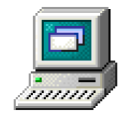
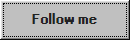

<table width="764" style="border-collapse: collapse;">
  <tbody>
    <tr>
      <td align="center">
        

          
          <picture>
            <source media="(prefers-color-scheme: dark)" srcset="https://readme-typing-svg.demolab.com?font=VT323&size=24&letterSpacing=1px&duration=1000&pause=500&color=F7F7F7&vCenter=true&multiline=true&repeat=false&width=544&height=150&lines=%3E+Hello!+I'm+Eno;%3E+I'm+a+student+at+42+Tokyo;%3E+Aspiring+Full-Stack+Engineer;%3E+Passionate+about+weight+training_">
            
          </picture>
        

      </td>
    </tr>
    <tr>
      <td align="right">
        
      </td>
    </tr>
  </tbody>
</table>

## <b> Skills</b>
> Tools and Technologies

<table>
  <tr>
    <td align="center" width="96">
      
       C
    </td>
    <td align="center" width="96">
      
       Python
    </td>
    <td align="center" width="96">
      
       Linux
    </td>
    <td align="center" width="96">
      
       Bash
    </td>
    <td align="center" width="96">
      
       AWS
    </td>
    <td align="center" width="96">
      
       GitHub
    </td>
    <td align="center" width="96">
      
       Neovim
    </td>
  </tr>
</table>

##  <b>Currently Learning / Familiar With</b>
> Languages and Frameworks I'm exploring
<table>
  <tr>
    <td align="center" width="96">
      
       Docker
    </td>
    <td align="center" width="96">
      
       Go
    </td>
    <td align="center" width="96">
      
       Rust
    </td>
    <td align="center" width="96">
      
       PostgreSQL
    </td>
  </tr>
  <tr>
    <td align="center" width="96">
      
       TypeScript
    </td>
    <td align="center" width="96">
      
       React
    </td>
    <td align="center" width="96">
      
       Swift
    </td>
    <td align="center" width="96">
      
       Flutter
    </td>
  </tr>
</table>

## <b> Statistics </b>

  
  
   
  
  

<picture>
  <source media="(prefers-color-scheme: dark)" srcset="https://raw.githubusercontent.com/Shigure-st/Shigure-st/output/github-contribution-grid-snake-dark.svg">
  <source media="(prefers-color-scheme: light)" srcset="https://raw.githubusercontent.com/Shigure-st/Shigure-st/output/github-contribution-grid-snake.svg">
  
</picture>
  

 
